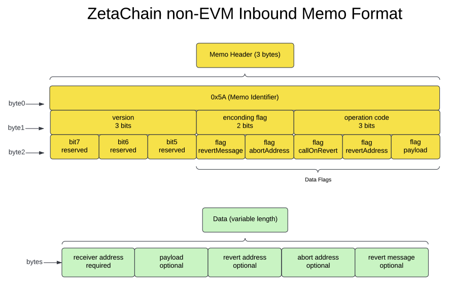

<h1 style="text-align: center;">A proposed standard memo format for non-EVM chains</h1>
<br>

## The goal

This doc is aimed to introduce a standard format of ZetaChain inbound `memo` across non-EVM chains. The `memo` in an inbound transaction is to carry both instructions and data, by which the cross-chain transaction to be processed as expected in the `zetacore`. A standard memo format helps to ensure consistent developer experience across EVM and non-EVM chains.
<br><br>


## The EVM gateway inbound events

We want to mimic below `Deposit` and `Called` events in the EVM `gateway` contract for non-EVM chains. Typically, we at least want the following 3 pieces at the time of writing.

- The `receiver` address in ZEVM.
- The `payload` of the call.
- The `RevertOptions`.

```
event Deposited(
    address indexed sender,
    address indexed receiver,
    uint256 amount,
    address asset,
    bytes payload,
    RevertOptions revertOptions
);

event Called(
	   address indexed sender,
	   address indexed receiver,
	   bytes payload,
	   RevertOptions revertOptions
);
```
<br><br>


## 1. The Memo Diagram

<br><br>


## 2. The memo structure

The raw-byte representation of a standard non-EVM memo contains `9` sections (2 mandatory + 7 optional). 

`Section 0` is the `header`, which controls how the memo should be interpreted.

`Section 1~8` are data sections that carry actual data attached to the memo.


|                 | Section 0  | Section 1   | Section 2   | Section 3      | Section 4    | Section 5    | Section 6     | Section 7   | Section 8   |
|-----------------|------------|-------------|-------------|----------------|--------------|--------------|---------------|-------------|-------------|
| **Name**        | Header     | Receiver    | Payload     | RevertAddress  | CallOnRevert | AbortAddress | RevertMessage | reserved    | reserved    |
| **Size (byte)** | 3          | 20          | variable    | variable       | 1            | 20           | variable      | --          | --          |
| **Type**        | [3]byte    | ZEVM address| bytes       | non-EVM address| bool         | ZEVM address | bytes         | --          | --          |
| **Optional**    | No         | No          | Yes         | Yes            | Yes          | Yes          | Yes           | --          | --          |
<br><br>


## 3. The header

The `3-byte` header is a self-contained declaration of the memo properties and rules. The proposed header structure is designed in a flexible manner. The data fields are all declared as optional. With `reserved` flags, new features and fields can be added  in the future without breaking compatibility.

### `byte-0`: Memo Identifier

The ASCII code `0x5A` of letter `'Z'` is used as the identifier of the standard ZetaChain memo format. Once legacy memo is phased out, zetaclient will only accept memos beginning with `0x5A`.


### `byte-1`: Control Byte

|                 | bit 5 ~ 7                       | bit 3 ~ 4                      | bit 0 ~ 2                                                |
|-----------------|---------------------------------|--------------------------------|----------------------------------------------------------|
| **Name**        | version #                       | encoding flag                  | operation code                                           |
|                 |                                 |                                | No for non-contract chains; Ignored for contract chains  |
| **Optional**    | No (0b000 for now)              | No (0b00 or 0b01 or 0b10)      | The operation code is already differentiated by method names in contract based chains |


### `byte-2`: Data Flags

|                 | bit 7         | bit 6        | bit 5         | bit 4             | bit 3            | bit 2            | bit 1             | bit 0            |
|-----------------|---------------|--------------|---------------|-------------------|------------------|------------------|-------------------|------------------|
| **Name**        | flag reserved | flag reserved| flag reserved | flag RevertMessage| flag AbortAddress| flag CallOnRevert| flag RevertAddress| flag Payload     |
| **Optional**    | --            | --           | --            | Yes               | Yes              | Yes              | Yes               | Yes              |
<br>

Supported `operation codes` :

The `operation code` is designed for the developers to explicitly specify the intention of an inbound transaction in non-contract chains (e.g. Bitcoin, Doge, …). A 3-bit operation code would allow `8` operation codes at maximum.

| 0b000      | 0b001            | 0b010      |
|------------|------------------|------------|
| deposit    | deposit_and_call | call       |

<br>


Supported `encoding flags`:
This flag is to tell `zetaclient` how the memo fields should be decoded. A 2-bit weight flag seems good enough and won’t change in future.

| 0b00         | 0b01             | 0b10             |
|--------------|------------------|------------------|
| ABI encoded  | lite-data short  | lite-data long   |
<br><br>


## 4. The types

To decode/encode the memo fields with the lite-date format, we've defined a few types below.
To decode/encode the memo fields with ABI format, just follow the [ABI Spec](https://docs.soliditylang.org/en/develop/abi-spec.html).


|                Field        | Size (byte)  | Description                                                                                                                     |
|-----------------------------|--------------|---------------------------------------------------------------------------------------------------------------------------------|
| **ZEVM address**            | fixed, 20    | The raw bytes representation of a ZEVM address. ZEVM address is the same as standard Ethereum address.                          |
| **non-EVM address**         | variable     | The raw bytes representation of a non-EVM external chain address. Different addresses have different lengths, e.g., Bitcoin vs Solana; Bitcoin Segwit vs Legacy. |
| **bytes**                   | variable     | The raw bytes of arbitrary data.                                                                                                |
<br><br>


## 5. Byte layout of variable-length types

There are two ways to encode your the memo fields into raw bytes. The `ABI encoded` and `lite-data` encoded.

| Decoding flag | Format            | Layout                                  | Description                                   | Rule                                                     |
|---------------|-------------------|-----------------------------------------|-----------------------------------------------|----------------------------------------------------------|
| 0b00          | ABI encoded       | ABI encoded types                       | Types are packed/unpacked with ABI standard   | [ABI Spec](https://docs.soliditylang.org/en/develop/abi-spec.html) |
| 0b01          | lite-data short   | [1-byte length] + [data]                | Carry up to 255 bytes of data.                | A valid length must > 0 and match data length.           |
| 0b10          | lite-data long    | [2-byte length, little-endian] + [data] | Carry up to 65535 bytes (64KB) of data.       | A valid length must > 0 and match data length.           |


