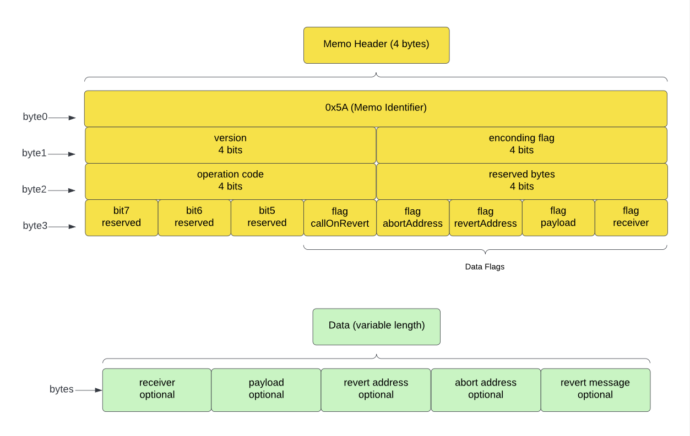

# A proposed standard memo format for non-EVM chains
<br>

## The goal

This doc is aimed to introduce a standard format of ZetaChain inbound `memo` across non-EVM chains. The `memo` in an inbound transaction is to carry both instructions and data, by which the cross-chain transaction to be processed as expected in the `zetacore`. A standard memo format helps to ensure consistent developer experience across EVM and non-EVM chains.
<br><br>


## The EVM gateway inbound events

We want to mimic below `Deposit` and `Called` events in the EVM `gateway` contract for non-EVM chains. Typically, we at least want the following 3 pieces at the time of writing.

- The `receiver` address in ZEVM.
- The `payload` of the call.
- The `RevertOptions`.

```
event Deposited(
    address indexed sender,
    address indexed receiver,
    uint256 amount,
    address asset,
    bytes payload,
    RevertOptions revertOptions
);

event Called(
    address indexed sender,
    address indexed receiver,
    bytes payload,
    RevertOptions revertOptions
);
```
<br><br>


## 1. The Memo Diagram

<br><br>


## 2. The memo structure

The raw-byte representation of a standard non-EVM memo contains `9` sections (2 mandatory + 7 optional). 

`Section 0` is the `header`, which controls how the memo should be interpreted.

`Section 1~8` are data sections that carry actual data attached to the memo.


|                 | Section 0  | Section 1   | Section 2   | Section 3      | Section 4    | Section 5    | Section 6     | Section 7   | Section 8   |
|-----------------|------------|-------------|-------------|----------------|--------------|--------------|---------------|-------------|-------------|
| **Name**        | Header     | Receiver    | Payload     | RevertAddress  | CallOnRevert | AbortAddress | RevertMessage | reserved    | reserved    |
| **Size (byte)** | 4          | 20          | variable    | variable       | 1            | 20           | variable      | --          | --          |
| **Type**        | [4]byte    | ZEVM address| bytes       | non-EVM address| bool         | ZEVM address | bytes         | --          | --          |
| **Optional**    | No         | Yes         | Yes         | Yes            | Yes          | Yes          | Yes           | --          | --          |
<br><br>


## 3. The header

The `4-byte` header is a self-contained declaration of the memo properties and rules. The proposed header structure is designed in a flexible manner. The data fields are all declared as optional. With `reserved` flags, new features and fields can be added  in the future without breaking compatibility.

### `byte-0`: Memo Identifier

The ASCII code `0x5A` of letter `'Z'` is used as the identifier of the standard ZetaChain memo format. Once legacy memo is phased out, zetaclient will only accept memos beginning with `0x5A`.


### `byte-1`: Control Byte

|                 | bit 4 ~ 7                                      | bit 0 ~ 3                            |
|-----------------|------------------------------------------------|--------------------------------------|
| **Name**        | version #                                      | encoding format                      |
| **Optional**    | No (0b0000 for now)                            | No (0b0000 or 0b0001 or 0b0010)      |
<br>


### `byte-2`: Control Byte

|                 | bit 4 ~ 7                                      | bit 0 ~ 3                      |
|-----------------|------------------------------------------------|--------------------------------|
| **Name**        | operation code                                 | control bytes reserved         |
| **Optional**    | No (0b0000 or 0001 or 0010 for now)            | --                             |
<br>


### `byte-3`: Data Flags

|                 | bit 7         | bit 6        | bit 5              | bit 4             | bit 3            | bit 2             | bit 1           | bit 0            |
|-----------------|---------------|--------------|--------------------|-------------------|------------------|-------------------|-----------------|------------------|
| **Name**        | flag reserved | flag reserved| flag RevertMessage | flag CallOnRevert | flag AbortAddress| flag RevertAddress| flag Payload    | flag Receiver    |
| **Optional**    | --            | --           | Yes                | Yes               | Yes              | Yes               | Yes             | Yes              |
<br>

Supported `operation codes` :

The `operation code` is designed for the developers to explicitly specify the intention of an inbound transaction in non-contract chains (e.g. Bitcoin, Doge, …).
The operation code is not necessary for non-contract chains, because the method name tells the intention of the transaction.

A 4-bit operation code would allow `16` operation codes at maximum.

| 0b0000      | 0b0001            | 0b0010      |
|-------------|-------------------|-------------|
| deposit     | deposit_and_call  | call        |
<br>


Supported `encoding flags`:
This flag is to tell `zetaclient` how the memo fields should be decoded. A 2-bit weight flag seems good enough and won’t change in future.<br>
Note: the `compact *` encoding is to minimizes length of memo data (compared to ABI) and will be explained in following sections.

| 0b00 00      | 0b000          | 0b0010       |
|--------------|----------------|--------------|
| ABI encoded  | compact short  | compact long |
<br><br>


## 4. The types

To decode/encode the memo fields with `compact *` format, we've defined a few types below.
To decode/encode the memo fields with `ABI encoded` format, just follow the [ABI Spec](https://docs.soliditylang.org/en/develop/abi-spec.html).


|                Field        | Size (byte)  | Description                                                                                                                     |
|-----------------------------|--------------|---------------------------------------------------------------------------------------------------------------------------------|
| **ZEVM address**            | fixed, 20    | The raw bytes representation of a ZEVM address. ZEVM address is the same as standard Ethereum address.                          |
| **non-EVM address**         | variable     | The raw bytes representation of a non-EVM external chain address. Different addresses have different lengths, e.g., Bitcoin vs Solana; Bitcoin Segwit vs Legacy. |
| **bytes**                   | variable     | The raw bytes of arbitrary data.                                                                                                |
<br><br>


## 5. Byte layout of variable-length types

There are two ways to encode your the memo fields into raw bytes. The `ABI encoded` and `compact *` encoded.

| Decoding flag | Format        | Layout                                  | Description                                   | Rule                                                     |
|---------------|---------------|-----------------------------------------|-----------------------------------------------|----------------------------------------------------------|
| 0b0000        | ABI encoded   | ABI encoded types                       | Types are packed/unpacked with ABI standard   | [ABI Spec](https://docs.soliditylang.org/en/develop/abi-spec.html) |
| 0b0001        | compact short | [1-byte length] + [data]                | Carry up to 255 bytes of data.                | A valid length (>= 0) must match data length.            |
| 0b0010        | compact long  | [2-byte length, little-endian] + [data] | Carry up to 65535 bytes (64KB) of data.       | A valid length (>= 0) must match data length.            |
|


## 6. How to pack your inbound memo

### Step-1: prepare your memo header

```go
func MakeHead() []byte {
	header := make([]byte, 4)
	header[0] = 'Z'
	header[1] = 0<<4 | 0b0010 // version + encoding format (e.g. compact long)
	header[2] = 0b0001 << 4   // operation code (e.g. DepositAndCall)
	header[3] = 0b00000111    // receiver, payload and revertAddress are set
	return header
}
```


### Step-2: pack your memo data

For use cases that requires compact transaction data, choose encoding format of `compact short` or `compact long`.

```go
func CompactPack(receiver common.Address, payload []byte, revertAddress string) []byte {
	data := make([]byte, 0)

	// pack receiver (fixed 20	bytes)
	data = append(data, receiver.Bytes()...)

	// pack payload (dynamic)
	// encode length with 1 byte if 'compact short' is your choice
	lenthPayload := make([]byte, 2)
	binary.LittleEndian.PutUint16(lenthPayload, uint16(len(payload)))

	data = append(data, lenthPayload...) // write length
	data = append(data, payload...)      // write payload

	// pack revert address (dynamic).
	// encode length with 1 byte if 'compact short' is your choice
	lengthRevertAddr := make([]byte, 2)
	binary.LittleEndian.PutUint16(lengthRevertAddr, uint16(len([]byte(revertAddress))))

	data = append(data, lengthRevertAddr...)      // write length
	data = append(data, []byte(revertAddress)...) // write revert address

	return data
}
```


Also, ABI encoding format is another option to consider.

```go
func ABIPack(receiver common.Address, payload []byte, revertAddress string) ([]byte, error) {
	// define the ABI for encoding the types: address, bytes, string
	abiString := `[{"type":"function","name":"encode","inputs":[
		{"type":"address"},
		{"type":"bytes"},
		{"type":"string"}],
		"outputs":[]}]`

	// parse the ABI
	parsedABI, err := abi.JSON(strings.NewReader(abiString))
	if err != nil {
		return nil, err
	}

	// pack the values using the ABI
	data, err := parsedABI.Pack("encode", receiver, payload, revertAddress)
	if err != nil {
		return nil, err
	}

	// remove the 4-byte selector
	return data[4:], nil
}
```
