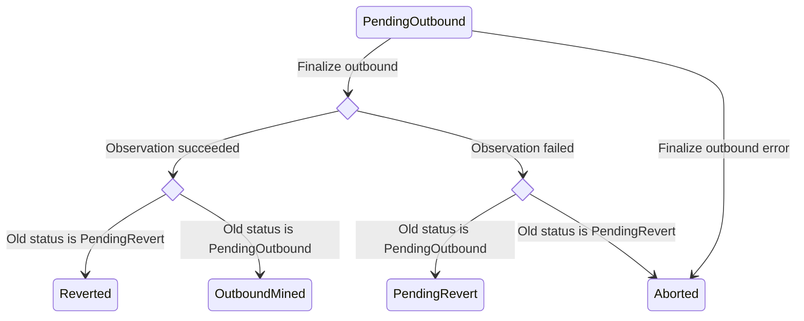
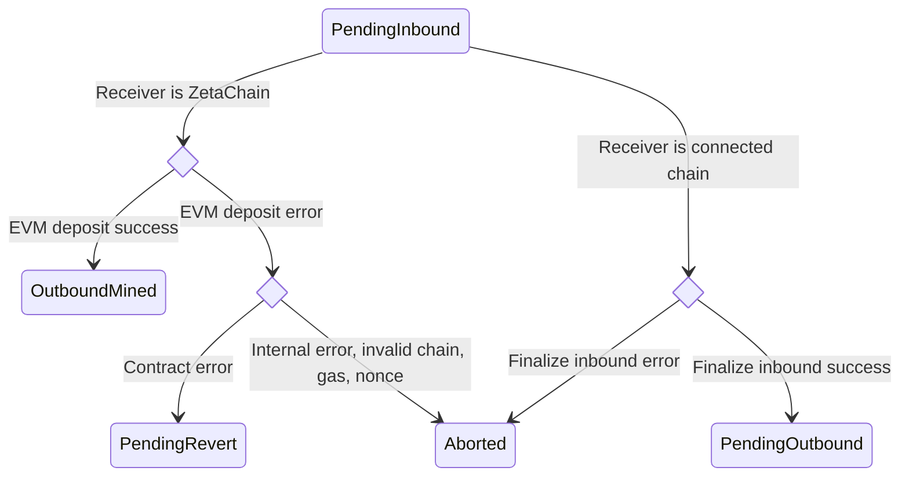

# Messages

## MsgAddToOutTxTracker

AddToOutTxTracker adds a new record to the outbound transaction tracker.
only the admin policy account and the observer validators are authorized to broadcast this message without proof.
If no pending cctx is found, the tracker is removed, if there is an existed tracker with the nonce & chainID.

Authorized: admin policy group 1, observer.

```proto
message MsgAddToOutTxTracker {
	string creator = 1;
	int64 chain_id = 2;
	uint64 nonce = 3;
	string tx_hash = 4;
	common.Proof proof = 5;
	string block_hash = 6;
	int64 tx_index = 7;
}
```

## MsgAddToInTxTracker

AddToInTxTracker adds a new record to the inbound transaction tracker.

Authorized: admin policy group 1, observer.

```proto
message MsgAddToInTxTracker {
	string creator = 1;
	int64 chain_id = 2;
	string tx_hash = 3;
	common.CoinType coin_type = 4;
	common.Proof proof = 5;
	string block_hash = 6;
	int64 tx_index = 7;
}
```

## MsgRemoveFromOutTxTracker

RemoveFromOutTxTracker removes a record from the outbound transaction tracker by chain ID and nonce.

Authorized: admin policy group 1.

```proto
message MsgRemoveFromOutTxTracker {
	string creator = 1;
	int64 chain_id = 2;
	uint64 nonce = 3;
}
```

## MsgGasPriceVoter

GasPriceVoter submits information about the connected chain's gas price at a specific block
height. Gas price submitted by each validator is recorded separately and a
median index is updated.

Only observer validators are authorized to broadcast this message.

```proto
message MsgGasPriceVoter {
	string creator = 1;
	int64 chain_id = 2;
	uint64 price = 3;
	uint64 block_number = 4;
	string supply = 5;
}
```

## MsgVoteOnObservedOutboundTx

VoteOnObservedOutboundTx casts a vote on an outbound transaction observed on a connected chain (after
it has been broadcasted to and finalized on a connected chain). If this is
the first vote, a new ballot is created. When a threshold of votes is
reached, the ballot is finalized. When a ballot is finalized, the outbound
transaction is processed.

If the observation is successful, the difference between zeta burned
and minted is minted by the bank module and deposited into the module
account.

If the observation is unsuccessful, the logic depends on the previous
status.

If the previous status was `PendingOutbound`, a new revert transaction is
created. To cover the revert transaction fee, the required amount of tokens
submitted with the CCTX are swapped using a Uniswap V2 contract instance on
ZetaChain for the ZRC20 of the gas token of the receiver chain. The ZRC20
tokens are then
burned. The nonce is updated. If everything is successful, the CCTX status is
changed to `PendingRevert`.

If the previous status was `PendingRevert`, the CCTX is aborted.



Only observer validators are authorized to broadcast this message.

```proto
message MsgVoteOnObservedOutboundTx {
	string creator = 1;
	string cctx_hash = 2;
	string observed_outTx_hash = 3;
	uint64 observed_outTx_blockHeight = 4;
	uint64 observed_outTx_gas_used = 10;
	string observed_outTx_effective_gas_price = 11;
	uint64 observed_outTx_effective_gas_limit = 12;
	string value_received = 5;
	common.ReceiveStatus status = 6;
	int64 outTx_chain = 7;
	uint64 outTx_tss_nonce = 8;
	common.CoinType coin_type = 9;
}
```

## MsgVoteOnObservedInboundTx

VoteOnObservedInboundTx casts a vote on an inbound transaction observed on a connected chain. If this
is the first vote, a new ballot is created. When a threshold of votes is
reached, the ballot is finalized. When a ballot is finalized, a new CCTX is
created.

If the receiver chain is ZetaChain, `HandleEVMDeposit` is called. If the
tokens being deposited are ZETA, `MintZetaToEVMAccount` is called and the
tokens are minted to the receiver account on ZetaChain. If the tokens being
deposited are gas tokens or ERC20 of a connected chain, ZRC20's `deposit`
method is called and the tokens are deposited to the receiver account on
ZetaChain. If the message is not empty, system contract's `depositAndCall`
method is also called and an omnichain contract on ZetaChain is executed.
Omnichain contract address and arguments are passed as part of the message.
If everything is successful, the CCTX status is changed to `OutboundMined`.

If the receiver chain is a connected chain, the `FinalizeInbound` method is
called to prepare the CCTX to be processed as an outbound transaction. To
cover the outbound transaction fee, the required amount of tokens submitted
with the CCTX are swapped using a Uniswap V2 contract instance on ZetaChain
for the ZRC20 of the gas token of the receiver chain. The ZRC20 tokens are
then burned. The nonce is updated. If everything is successful, the CCTX
status is changed to `PendingOutbound`.



Only observer validators are authorized to broadcast this message.

```proto
message MsgVoteOnObservedInboundTx {
	string creator = 1;
	string sender = 2;
	int64 sender_chain_id = 3;
	string receiver = 4;
	int64 receiver_chain = 5;
	string amount = 6;
	string message = 8;
	string in_tx_hash = 9;
	uint64 in_block_height = 10;
	uint64 gas_limit = 11;
	common.CoinType coin_type = 12;
	string tx_origin = 13;
	string asset = 14;
	uint64 event_index = 15;
}
```

## MsgWhitelistERC20

WhitelistERC20 deploys a new zrc20, create a foreign coin object for the ERC20
and emit a crosschain tx to whitelist the ERC20 on the external chain

Authorized: admin policy group 1.

```proto
message MsgWhitelistERC20 {
	string creator = 1;
	string erc20_address = 2;
	int64 chain_id = 3;
	string name = 4;
	string symbol = 5;
	uint32 decimals = 6;
	int64 gas_limit = 7;
}
```

## MsgUpdateTssAddress

Authorized: admin policy group 2.

```proto
message MsgUpdateTssAddress {
	string creator = 1;
	string tss_pubkey = 2;
}
```

## MsgMigrateTssFunds

Authorized: admin policy group 2.

```proto
message MsgMigrateTssFunds {
	string creator = 1;
	int64 chain_id = 2;
	string amount = 3;
}
```

## MsgCreateTSSVoter

CreateTSSVoter votes on creating a TSS key and recording the information about it (public
key, participant and operator addresses, finalized and keygen heights).

If the vote passes, the information about the TSS key is recorded on chain
and the status of the keygen is set to "success".

Fails if the keygen does not exist, the keygen has been already
completed, or the keygen has failed.

Only node accounts are authorized to broadcast this message.

```proto
message MsgCreateTSSVoter {
	string creator = 1;
	string tss_pubkey = 2;
	int64 keyGenZetaHeight = 3;
	common.ReceiveStatus status = 4;
}
```

## MsgAbortStuckCCTX

AbortStuckCCTX aborts a stuck CCTX
Authorized: admin policy group 2

```proto
message MsgAbortStuckCCTX {
	string creator = 1;
	string cctx_index = 2;
}
```

