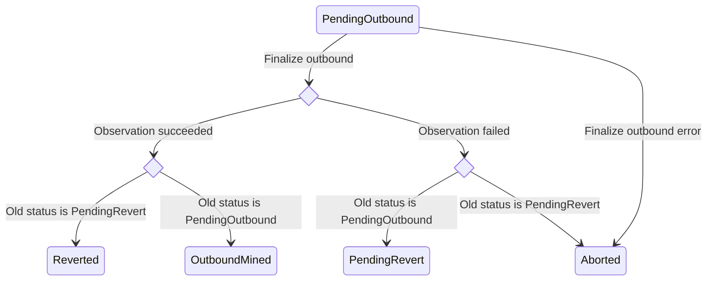
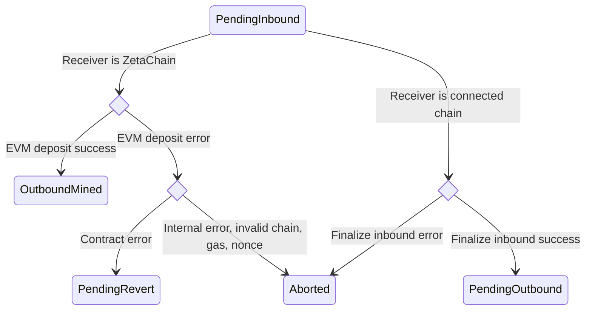

## authority

### Messages

#### MsgUpdatePolicies

UpdatePolicies updates policies

```proto
message MsgUpdatePolicies {
	string creator = 1;
	Policies policies = 2;
}
```

#### MsgUpdateChainInfo

UpdateChainInfo updates the chain info object
If the provided chain does not exist in the chain info object, it is added
If the chain already exists in the chain info object, it is updated

```proto
message MsgUpdateChainInfo {
	string creator = 1;
	pkg.chains.Chain chain = 3;
}
```

#### MsgRemoveChainInfo

RemoveChainInfo removes the chain info for the specified chain id

```proto
message MsgRemoveChainInfo {
	string creator = 1;
	int64 chain_id = 2;
}
```

#### MsgAddAuthorization

AddAuthorization defines a method to add an authorization.If the authorization already exists, it will be overwritten with the provided policy.
This should be called by the admin policy account.

```proto
message MsgAddAuthorization {
	string creator = 1;
	string msg_url = 2;
	PolicyType authorized_policy = 3;
}
```

#### MsgRemoveAuthorization

RemoveAuthorization removes the authorization from the list. It should be called by the admin policy account.

```proto
message MsgRemoveAuthorization {
	string creator = 1;
	string msg_url = 2;
}
```

## crosschain

### Overview

The `crosschain` module tracks inbound and outbound cross-chain transactions
(CCTX).

The main actors interacting with the Crosschain module are observer validators
(or "observers"). Observers are running an off-chain program (called
`zetaclient`) that watches connected blockchains for inbound transactions and
watches ZetaChain for pending outbound transactions and watches connected chains
for outbound transactions.

After observing an inbound or an outbound transaction, an observer participates
in a voting process.

#### Voting

When an observer submits a vote for a transaction a `ballot` is created (if it
wasn't created before). Observers are allowed to cast votes that will be
associated with this ballot. Based on `BallotThreshold`, when enough votes are
cast ballot is considered to be "finalized".

The last vote that moves the ballot to the "finalized" state triggers execution
and pays the gas costs of the cross-chain transaction.

Any votes cast after the ballot has been finalized are discarded.

#### Inbound Transaction

Inbound transactions are cross-chain transactions observed on connected chains.
To vote on an inbound transaction an observer broadcasts `MsgVoteInbound`.

The last vote that moves the ballot to the "finalized" state triggers execution
of the cross-chain transaction.

If the destination chain is ZetaChain and the CCTX does not contain a message,
ZRC20 tokens are deposited into an account on ZetaChain.

If the destination chain is ZetaChain and the CCTX contains a message, ZRC20
tokens are deposited and a contract on ZetaChain is called. Contract address and
the arguments for the contract call are contained within the message.

If the destination chain is not ZetaChain, the status of a transaction is
changed to "pending outbound" and the CCTX to be processed as an outbound
transaction.

#### Outbound Transaction

###### Pending Outbound

Observers watch ZetaChain for pending outbound transactions. To process a
pending outbound transactions observers enter into a TSS keysign ceremony to
sign the transaction, and then broadcast the signed transaction to the connected
blockchains.

###### Observed Outbound

Observers watch connected blockchains for the broadcasted outbound transactions.
Once a transaction is "confirmed" (or "mined") on a connected blockchains,
observers vote on ZetaChain by sending a `VoteOutbound` message.

After the vote passes the threshold, the voting is finalized and a transaction's
status is changed to final.

#### Permissions

| Message                  | Admin policy account | Observer validator |
| ------------------------ | -------------------- | ------------------ |
| MsgVoteTSS               |                      | ✅                 |
| MsgGasPriceVoter         |                      | ✅                 |
| MsgVoteOutbound          |                      | ✅                 |
| MsgVoteInbound           |                      | ✅                 |
| MsgAddOutboundTracker    | ✅                   | ✅                 |
| MsgRemoveOutboundTracker | ✅                   |                    |

#### State

The module stores the following information in the state:

- List of outbound transactions
- List of chain nonces
- List of last chain heights
- List of cross-chain transactions
- Mapping between inbound transactions and cross-chain transactions
- TSS key
- Gas prices on connected chains submitted by observers


### Messages

#### MsgAddOutboundTracker

AddOutboundTracker adds a new record to the outbound transaction tracker.
only the admin policy account and the observer validators are authorized to broadcast this message without proof.
If no pending cctx is found, the tracker is removed, if there is an existed tracker with the nonce & chainID.

```proto
message MsgAddOutboundTracker {
	string creator = 1;
	int64 chain_id = 2;
	uint64 nonce = 3;
	string tx_hash = 4;
	pkg.proofs.Proof proof = 5;
	string block_hash = 6;
	int64 tx_index = 7;
}
```

#### MsgAddInboundTracker

AddInboundTracker adds a new record to the inbound transaction tracker.

```proto
message MsgAddInboundTracker {
	string creator = 1;
	int64 chain_id = 2;
	string tx_hash = 3;
	pkg.coin.CoinType coin_type = 4;
	pkg.proofs.Proof proof = 5;
	string block_hash = 6;
	int64 tx_index = 7;
}
```

#### MsgRemoveInboundTracker

RemoveInboundTracker removes the inbound tracker if it exists.

```proto
message MsgRemoveInboundTracker {
	string creator = 1;
	int64 chain_id = 2;
	string tx_hash = 3;
}
```

#### MsgRemoveOutboundTracker

RemoveOutboundTracker removes a record from the outbound transaction tracker by chain ID and nonce.

Authorized: admin policy group 1.

```proto
message MsgRemoveOutboundTracker {
	string creator = 1;
	int64 chain_id = 2;
	uint64 nonce = 3;
}
```

#### MsgVoteGasPrice

VoteGasPrice submits information about the connected chain's gas price at a specific block
height. Gas price submitted by each validator is recorded separately and a
median index is updated.

Only observer validators are authorized to broadcast this message.

```proto
message MsgVoteGasPrice {
	string creator = 1;
	int64 chain_id = 2;
	uint64 price = 3;
	uint64 priority_fee = 6;
	uint64 block_number = 4;
	string supply = 5;
}
```

#### MsgVoteOutbound

VoteOutbound casts a vote on an outbound transaction observed on a connected chain (after
it has been broadcasted to and finalized on a connected chain). If this is
the first vote, a new ballot is created. When a threshold of votes is
reached, the ballot is finalized. When a ballot is finalized, the outbound
transaction is processed.

If the observation is successful, the difference between zeta burned
and minted is minted by the bank module and deposited into the module
account.

If the observation is unsuccessful, the logic depends on the previous
status.

If the previous status was `PendingOutbound`, a new revert transaction is
created. To cover the revert transaction fee, the required amount of tokens
submitted with the CCTX are swapped using a Uniswap V2 contract instance on
ZetaChain for the ZRC20 of the gas token of the receiver chain. The ZRC20
tokens are then
burned. The nonce is updated. If everything is successful, the CCTX status is
changed to `PendingRevert`.

If the previous status was `PendingRevert`, the CCTX is aborted.



Only observer validators are authorized to broadcast this message.

```proto
message MsgVoteOutbound {
	string creator = 1;
	string cctx_hash = 2;
	string observed_outbound_hash = 3;
	uint64 observed_outbound_block_height = 4;
	uint64 observed_outbound_gas_used = 10;
	string observed_outbound_effective_gas_price = 11;
	uint64 observed_outbound_effective_gas_limit = 12;
	string value_received = 5;
	pkg.chains.ReceiveStatus status = 6;
	int64 outbound_chain = 7;
	uint64 outbound_tss_nonce = 8;
	pkg.coin.CoinType coin_type = 9;
	ConfirmationMode confirmation_mode = 13;
}
```

#### MsgVoteInbound

VoteInbound casts a vote on an inbound transaction observed on a connected chain. If this
is the first vote, a new ballot is created. When a threshold of votes is
reached, the ballot is finalized. When a ballot is finalized, a new CCTX is
created.

If the receiver chain is ZetaChain, `HandleEVMDeposit` is called. If the
tokens being deposited are ZETA, `MintZetaToEVMAccount` is called and the
tokens are minted to the receiver account on ZetaChain. If the tokens being
deposited are gas tokens or ERC20 of a connected chain, ZRC20's `deposit`
method is called and the tokens are deposited to the receiver account on
ZetaChain. If the message is not empty, system contract's `depositAndCall`
method is also called and an omnichain contract on ZetaChain is executed.
Omnichain contract address and arguments are passed as part of the message.
If everything is successful, the CCTX status is changed to `OutboundMined`.

If the receiver chain is a connected chain, the `FinalizeInbound` method is
called to prepare the CCTX to be processed as an outbound transaction. To
cover the outbound transaction fee, the required amount of tokens submitted
with the CCTX are swapped using a Uniswap V2 contract instance on ZetaChain
for the ZRC20 of the gas token of the receiver chain. The ZRC20 tokens are
then burned. The nonce is updated. If everything is successful, the CCTX
status is changed to `PendingOutbound`.



Only observer validators are authorized to broadcast this message.

```proto
message MsgVoteInbound {
	string creator = 1;
	string sender = 2;
	int64 sender_chain_id = 3;
	string receiver = 4;
	int64 receiver_chain = 5;
	string amount = 6;
	string message = 8;
	string inbound_hash = 9;
	uint64 inbound_block_height = 10;
	uint64 gas_limit = 11;
	pkg.coin.CoinType coin_type = 12;
	string tx_origin = 13;
	string asset = 14;
	uint64 event_index = 15;
	ProtocolContractVersion protocol_contract_version = 16;
	RevertOptions revert_options = 17;
	CallOptions call_options = 18;
	bool is_cross_chain_call = 19;
	InboundStatus status = 20;
	ConfirmationMode confirmation_mode = 21;
	string error_message = 22;
}
```

#### MsgWhitelistAsset

WhitelistAsset deploys a new zrc20, create a foreign coin object for the asset
and emit a crosschain tx to whitelist the ERC20 on the external chain
an asset can be erc20 on EVM chains, SPL on Solana, etc

```proto
message MsgWhitelistAsset {
	string creator = 1;
	string asset_address = 2;
	int64 chain_id = 3;
	string name = 4;
	string symbol = 5;
	uint32 decimals = 6;
	int64 gas_limit = 7;
	string liquidity_cap = 8;
}
```

#### MsgUpdateTssAddress

UpdateTssAddress updates the TSS address.

```proto
message MsgUpdateTssAddress {
	string creator = 1;
	string tss_pubkey = 2;
}
```

#### MsgMigrateTssFunds

MigrateTssFunds migrates the funds from the current TSS to the new TSS

```proto
message MsgMigrateTssFunds {
	string creator = 1;
	int64 chain_id = 2;
	string amount = 3;
}
```

#### MsgAbortStuckCCTX

AbortStuckCCTX aborts a stuck CCTX
Authorized: admin policy group 2

```proto
message MsgAbortStuckCCTX {
	string creator = 1;
	string cctx_index = 2;
}
```

#### MsgRefundAbortedCCTX

RefundAbortedCCTX refunds the aborted CCTX.
It verifies if the CCTX is aborted and not refunded, and if the refund address is valid.
It refunds the amount to the refund address and sets the CCTX as refunded.
Refer to documentation for GetRefundAddress for the refund address logic.
Refer to documentation for GetAbortedAmount for the aborted amount logic.

```proto
message MsgRefundAbortedCCTX {
	string creator = 1;
	string cctx_index = 2;
	string refund_address = 3;
}
```

#### MsgUpdateRateLimiterFlags

UpdateRateLimiterFlags updates the rate limiter flags.
Authorized: admin policy operational.

```proto
message MsgUpdateRateLimiterFlags {
	string creator = 1;
	RateLimiterFlags rate_limiter_flags = 2;
}
```

## emissions

### Overview

The `emissions` module is responsible for orchestrating rewards distribution for
observers, validators and TSS signers. Currently, it only distributes rewards to
validators every block. The undistributed amount for TSS and observers is stored
in their respective pools.

The distribution of rewards is implemented in the begin blocker.

The module keeps track of parameters used for calculating rewards:

- Maximum bond factor
- Minimum bond factor
- Average block time
- Target bond ratio
- Validator emission percentage
- Observer emission percentage
- TSS Signer emission percentage
- Duration factor constant


### Messages

#### MsgUpdateParams

UpdateParams defines a governance operation for updating the x/emissions module parameters.
The authority is hard-coded to the x/gov module account.

```proto
message MsgUpdateParams {
	string authority = 1;
	Params params = 2;
}
```

#### MsgWithdrawEmission

WithdrawEmission allows the user to withdraw from their withdrawable emissions.
on a successful withdrawal, the amount is transferred from the undistributed rewards pool to the user's account.
if the amount to be withdrawn is greater than the available withdrawable emission, the max available amount is withdrawn.
if the pool does not have enough balance to process this request, an error is returned.

```proto
message MsgWithdrawEmission {
	string creator = 1;
	string amount = 2;
}
```

## fungible

### Overview

The `fungible` module facilitates the deployment of fungible tokens of connected
blockchains (called "foreign coins") on ZetaChain.

Foreign coins are represented as ZRC20 tokens on ZetaChain.

When a foreign coin is deployed on ZetaChain, a ZRC20 contract is deployed, a
pool is created, liquidity is added to the pool, and the foreign coin is added
to the list of foreign coins in the module's state.

The module contains the logic for:

- Deploying a foreign coin on ZetaChain
- Deploying a system contract, Uniswap and wrapped ZETA
- Depositing to and calling omnichain smart contracts on ZetaChain from
  connected chains (`DepositZRC20AndCallContract` and `DepositZRC20`)

the module depends heavily on the [protocol
contracts](https://github.com/zeta-chain/protocol-contracts).

#### State

The `fungible` module keeps track of the following state:

- System contract address
- A list of foreign coins


### Messages

#### MsgDeploySystemContracts

DeploySystemContracts deploy new instances of the system contracts

Authorized: admin policy group 2.

```proto
message MsgDeploySystemContracts {
	string creator = 1;
}
```

#### MsgDeployFungibleCoinZRC20

DeployFungibleCoinZRC20 deploys a fungible coin from a connected chains as a ZRC20 on ZetaChain.

If this is a gas coin, the following happens:

* ZRC20 contract for the coin is deployed
* contract address of ZRC20 is set as a token address in the system
contract
* ZETA tokens are minted and deposited into the module account
* setGasZetaPool is called on the system contract to add the information
about the pool to the system contract
* addLiquidityETH is called to add liquidity to the pool

If this is a non-gas coin, the following happens:

* ZRC20 contract for the coin is deployed
* The coin is added to the list of foreign coins in the module's state

Authorized: admin policy group 2.

```proto
message MsgDeployFungibleCoinZRC20 {
	string creator = 1;
	string ERC20 = 2;
	int64 foreign_chain_id = 3;
	uint32 decimals = 4;
	string name = 5;
	string symbol = 6;
	pkg.coin.CoinType coin_type = 7;
	int64 gas_limit = 8;
	string liquidity_cap = 9;
}
```

#### MsgRemoveForeignCoin

RemoveForeignCoin removes a coin from the list of foreign coins in the
module's state.

Authorized: admin policy group 2.

```proto
message MsgRemoveForeignCoin {
	string creator = 1;
	string zrc20_address = 2;
}
```

#### MsgUpdateSystemContract

UpdateSystemContract updates the system contract

```proto
message MsgUpdateSystemContract {
	string creator = 1;
	string new_system_contract_address = 2;
}
```

#### MsgUpdateContractBytecode

UpdateContractBytecode updates the bytecode of a contract from the bytecode
of an existing contract Only a ZRC20 contract or the WZeta connector contract
can be updated IMPORTANT: the new contract bytecode must have the same
storage layout as the old contract bytecode the new contract can add new
variable but cannot remove any existing variable

Authozied: admin policy group 2

```proto
message MsgUpdateContractBytecode {
	string creator = 1;
	string contract_address = 2;
	string new_code_hash = 3;
}
```

#### MsgUpdateZRC20WithdrawFee

UpdateZRC20WithdrawFee updates the withdraw fee and gas limit of a zrc20 token

```proto
message MsgUpdateZRC20WithdrawFee {
	string creator = 1;
	string zrc20_address = 2;
	string new_withdraw_fee = 6;
	string new_gas_limit = 7;
}
```

#### MsgUpdateZRC20LiquidityCap

UpdateZRC20LiquidityCap updates the liquidity cap for a ZRC20 token.

Authorized: admin policy group 2.

```proto
message MsgUpdateZRC20LiquidityCap {
	string creator = 1;
	string zrc20_address = 2;
	string liquidity_cap = 3;
}
```

#### MsgPauseZRC20

PauseZRC20 pauses a list of ZRC20 tokens
Authorized: admin policy group groupEmergency.

```proto
message MsgPauseZRC20 {
	string creator = 1;
	string zrc20_addresses = 2;
}
```

#### MsgUnpauseZRC20

UnpauseZRC20 unpauses the ZRC20 token
Authorized: admin policy group groupOperational.

```proto
message MsgUnpauseZRC20 {
	string creator = 1;
	string zrc20_addresses = 2;
}
```

#### MsgUpdateGatewayContract

UpdateGatewayContract updates the zevm gateway contract used by the ZetaChain protocol to read inbounds and process outbounds

```proto
message MsgUpdateGatewayContract {
	string creator = 1;
	string new_gateway_contract_address = 2;
}
```

#### MsgUpdateZRC20Name

UpdateZRC20Name updates the name and/or the symbol of a zrc20 token

```proto
message MsgUpdateZRC20Name {
	string creator = 1;
	string zrc20_address = 2;
	string name = 3;
	string symbol = 4;
}
```

#### MsgBurnFungibleModuleAsset

BurnFungibleModuleAsset burns the zrc20 balance on the fungible module
If the zero address is provided, it burns the native ZETA held from the fungible module

```proto
message MsgBurnFungibleModuleAsset {
	string creator = 1;
	string zrc20_address = 2;
}
```

#### MsgUpdateGatewayGasLimit

UpdateGatewayGasLimit updates the gateway gas limit used by the ZetaChain protocol

```proto
message MsgUpdateGatewayGasLimit {
	string creator = 1;
	uint64 new_gas_limit = 2;
}
```

## lightclient

### Messages

#### MsgEnableHeaderVerification

EnableHeaderVerification enables the verification flags for the given chain IDs
Enabled chains allow the submissions of block headers and using it to verify the correctness of proofs

```proto
message MsgEnableHeaderVerification {
	string creator = 1;
	int64 chain_id_list = 2;
}
```

#### MsgDisableHeaderVerification

DisableHeaderVerification disables the verification flags for the given chain IDs
Disabled chains do not allow the submissions of block headers or using it to verify the correctness of proofs

```proto
message MsgDisableHeaderVerification {
	string creator = 1;
	int64 chain_id_list = 2;
}
```

## observer

### Overview

The `observer` module keeps track of ballots for voting, a mapping between
chains and observer accounts, a list of supported connected chains, core
parameters (contract addresses, outbound transaction schedule interval, etc.),
observer parameters (ballot threshold, min observer delegation, etc.), and admin
policy parameters.

Ballots are used to vote on inbound and outbound transaction. The `observer`
module keeps create, read, update, and delete (CRUD) operations for ballots, as
well as helper functions to determine if a ballot has been finalized. The ballot
system is used by other modules, such as the `crosschain` module when observer
validators vote on transactions.

An observer validator is a validator that runs `zetaclient` alongside the
`zetacored` (the blockchain node) and is authorized to vote on inbound and
outbound cross-chain transactions.

A mapping between chains and observer accounts right now is set during genesis
and is used in the `crosschain` module to determine whether an observer
validator is authorized to vote on a transaction coming in/out of a specific
connected chain.


### Messages

#### MsgAddObserver

AddObserver adds an observer address to the observer set

```proto
message MsgAddObserver {
	string creator = 1;
	string observer_address = 2;
	string zetaclient_grantee_pubkey = 3;
	bool add_node_account_only = 4;
}
```

#### MsgRemoveObserver

RemoveObserver removes an observer address from the observer set and node account list

```proto
message MsgRemoveObserver {
	string creator = 1;
	string observer_address = 2;
}
```

#### MsgUpdateObserver

UpdateObserver handles updating an observer address
Authorized: admin policy (admin update), old observer address (if the
reason is that the observer was tombstoned).

```proto
message MsgUpdateObserver {
	string creator = 1;
	string old_observer_address = 2;
	string new_observer_address = 3;
	ObserverUpdateReason update_reason = 4;
}
```

#### MsgUpdateChainParams

UpdateChainParams updates chain parameters for a specific chain, or add a new one.
Chain parameters include: confirmation count, outbound transaction schedule interval, ZETA token,
connector and ERC20 custody contract addresses, etc.
Only the admin policy account is authorized to broadcast this message.

```proto
message MsgUpdateChainParams {
	string creator = 1;
	ChainParams chainParams = 2;
}
```

#### MsgRemoveChainParams

RemoveChainParams removes chain parameters for a specific chain.

```proto
message MsgRemoveChainParams {
	string creator = 1;
	int64 chain_id = 2;
}
```

#### MsgVoteBlame

```proto
message MsgVoteBlame {
	string creator = 1;
	int64 chain_id = 2;
	Blame blame_info = 3;
}
```

#### MsgUpdateKeygen

UpdateKeygen updates the block height of the keygen and sets the status to
"pending keygen".

Authorized: admin policy group 1.

```proto
message MsgUpdateKeygen {
	string creator = 1;
	int64 block = 2;
}
```

#### MsgVoteBlockHeader

VoteBlockHeader vote for a new block header to the storers

```proto
message MsgVoteBlockHeader {
	string creator = 1;
	int64 chain_id = 2;
	bytes block_hash = 3;
	int64 height = 4;
	pkg.proofs.HeaderData header = 5;
}
```

#### MsgResetChainNonces

ResetChainNonces handles resetting chain nonces

```proto
message MsgResetChainNonces {
	string creator = 1;
	int64 chain_id = 2;
	int64 chain_nonce_low = 3;
	int64 chain_nonce_high = 4;
}
```

#### MsgVoteTSS

VoteTSS votes on creating a TSS key and recording the information about it (public
key, participant and operator addresses, finalized and keygen heights).

If the vote passes, the information about the TSS key is recorded on chain
and the status of the keygen is set to "success".

Fails if the keygen does not exist, the keygen has been already
completed, or the keygen has failed.

Only node accounts are authorized to broadcast this message.

```proto
message MsgVoteTSS {
	string creator = 1;
	string tss_pubkey = 2;
	int64 keygen_zeta_height = 3;
	pkg.chains.ReceiveStatus status = 4;
}
```

#### MsgEnableCCTX

EnableCCTX enables the IsInboundEnabled and IsOutboundEnabled flags.These flags control the creation of inbounds and outbounds.
The flags are enabled by the policy account with the groupOperational policy type.

```proto
message MsgEnableCCTX {
	string creator = 1;
	bool enableInbound = 2;
	bool enableOutbound = 3;
}
```

#### MsgDisableCCTX

DisableCCTX disables the IsInboundEnabled and IsOutboundEnabled flags. These flags control the creation of inbounds and outbounds.
The flags are disabled by the policy account with the groupEmergency policy type.

```proto
message MsgDisableCCTX {
	string creator = 1;
	bool disableInbound = 2;
	bool disableOutbound = 3;
}
```

#### MsgDisableFastConfirmation

DisableFastConfirmation disables fast confirmation for the given chain ID
Inbound and outbound will be only confirmed using SAFE confirmation count on disabled chains

```proto
message MsgDisableFastConfirmation {
	string creator = 1;
	int64 chain_id = 2;
}
```

#### MsgUpdateGasPriceIncreaseFlags

UpdateGasPriceIncreaseFlags updates the GasPriceIncreaseFlags. These flags control the increase of gas prices.
The flags are updated by the policy account with the groupOperational policy type.

```proto
message MsgUpdateGasPriceIncreaseFlags {
	string creator = 1;
	GasPriceIncreaseFlags gasPriceIncreaseFlags = 2;
}
```

#### MsgUpdateOperationalFlags

```proto
message MsgUpdateOperationalFlags {
	string creator = 1;
	OperationalFlags operational_flags = 2;
}
```

#### MsgUpdateOperationalChainParams

UpdateOperationalChainParams updates the operational-related chain params
Unlike MsgUpdateChainParams, this message doesn't allow updated sensitive values such as the gateway contract to listen to on connected chains

```proto
message MsgUpdateOperationalChainParams {
	string creator = 1;
	int64 chain_id = 2;
	uint64 gas_price_ticker = 3;
	uint64 inbound_ticker = 4;
	uint64 outbound_ticker = 5;
	uint64 watch_utxo_ticker = 6;
	int64 outbound_schedule_interval = 7;
	int64 outbound_schedule_lookahead = 8;
	ConfirmationParams confirmation_params = 9;
	bool disable_tss_block_scan = 10;
}
```

